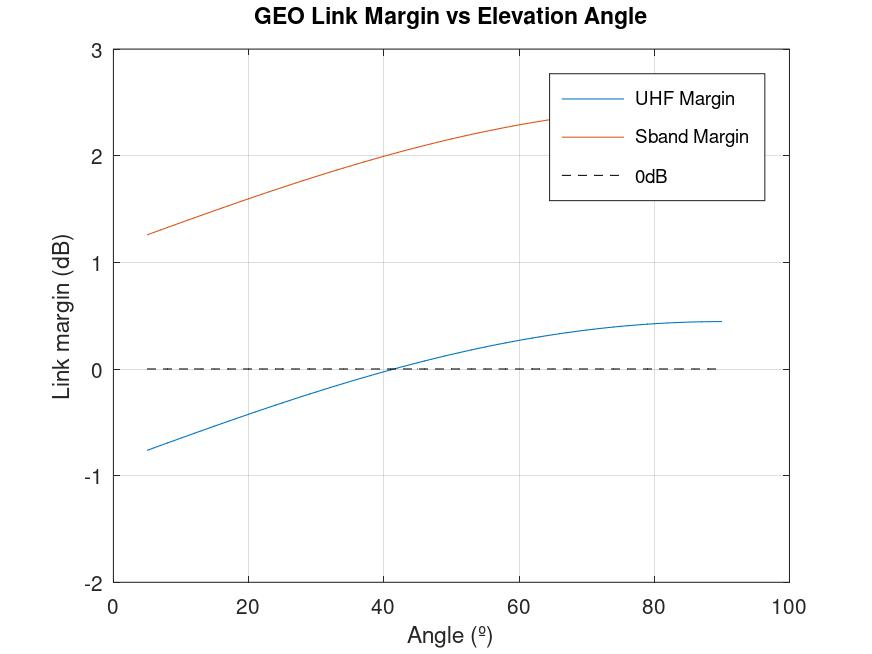
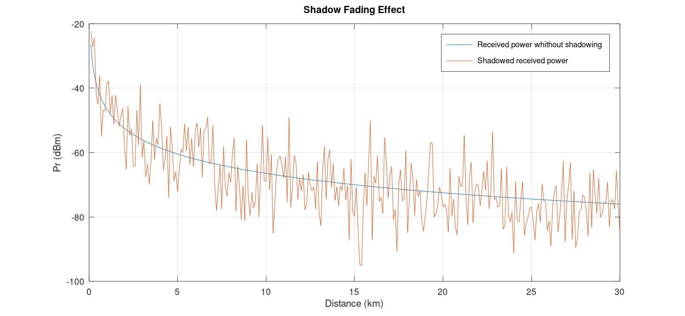
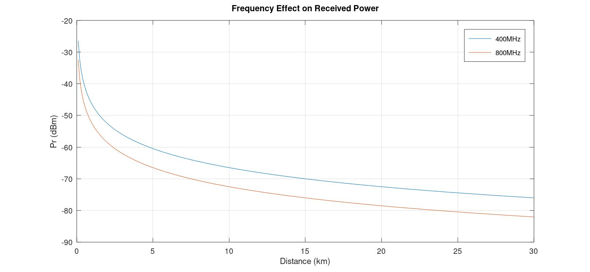
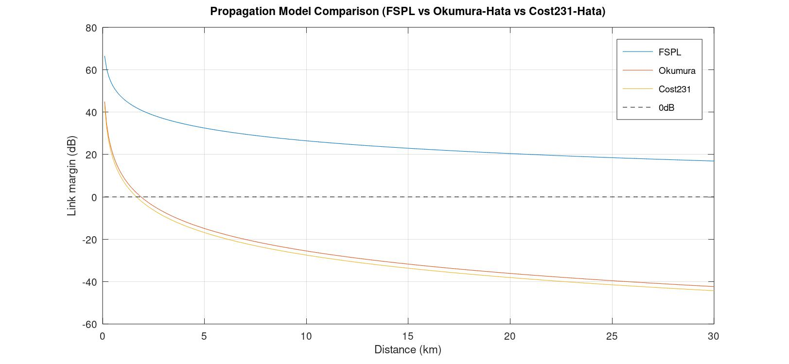
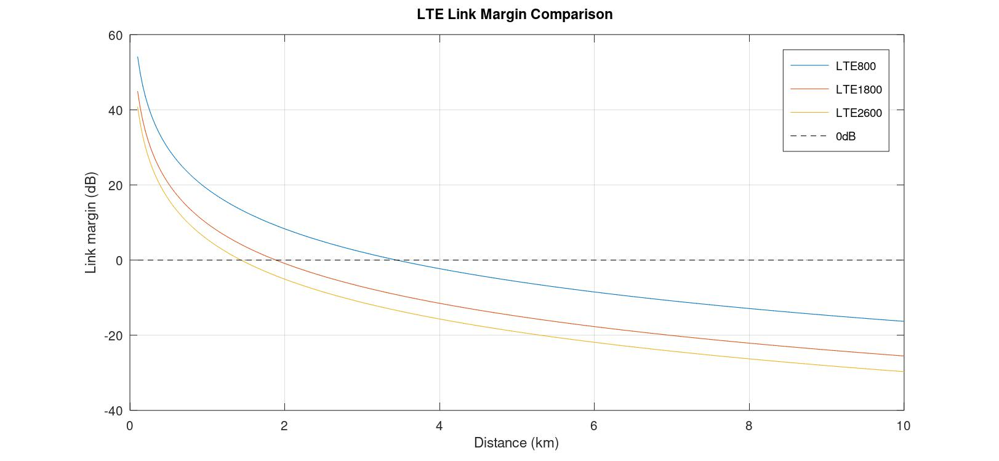
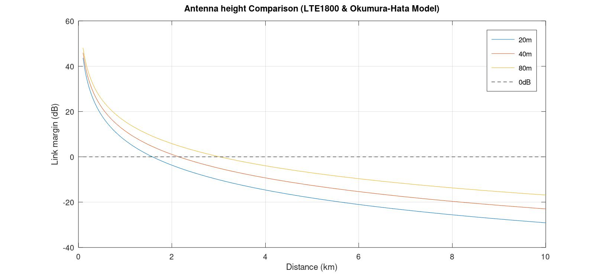

# RF Link Budget Simulator

A modular RF propagation and link budget simulation toolkit.  
Built to explore real-world radio coverage scenarios using validated propagation models.

Currently implemented in GNU Octave (prototype). Python migration in progress.

---

## Propagation Models

| Model | Frequency Range | Environment | Status |
|---|---|---|---|
| FSPL | Any | Free space / reference | ✅ Implemented |
| Log-normal shadowing | Any | Statistical overlay | ✅ Implemented |
| Okumura-Hata | 150–1500 MHz | Urban / suburban / rural | ✅ Implemented |
| COST 231-Hata | 1500–2000 MHz | Urban (extension) | ✅ Implemented |

---

## Results

### GEO Link Margin vs Elevation Angle

Comparison between UHF link margin and S-band link margin.
Despite of UHF's lower propagation loss the lower receiver antenna gain (13dBi Yagi vs 30 dBi parabolic dish for S-band) results in a lower link margin. The minimum operational elevation angle for UHF is 41.49º.



### Shadow Fading Effect
Log-normal shadowing overlaid on deterministic path loss.  
Illustrates signal variability around the mean — key for link margin and outage analysis.



---

### TETRA vs LTE800 — Received Power
Direct comparison between a critical communications system (TETRA, 400 MHz) and LTE800.  
TETRA's lower frequency provides ~8–10 dB advantage at distances beyond 10 km — relevant for public safety and defense coverage planning.



---

### Propagation Model Comparison — FSPL vs Okumura-Hata vs COST231
FSPL serves as the theoretical upper bound (free space, no clutter).  
Okumura-Hata and COST231 introduce realistic urban attenuation, showing 30–60 dB additional loss at range.



---

### LTE Band Comparison — 800 / 1800 / 2600 MHz
Link margin vs distance for the three main LTE deployment bands.  
LTE800 maintains positive link margin (~3.5 km), while LTE2600 fails beyond ~1.8 km under the same conditions.



---

### Antenna Height Sensitivity — LTE1800 (Okumura-Hata)
Effect of base station antenna height (20 / 40 / 80 m) on link margin.  
Quadruplicate height from 20m to 80m extends the usable range by ~2 km at 0 dB margin.



---

## Key Parameters (current baseline)

| Parameter | Value |
|---|---|
| Tx Power | 46 dBm (40W) |
| Tx Antenna Gain | 15 dBi |
| Rx Antenna Gain | 0 dBi |
| Rx Sensitivity | −95 dBm |
| BS Antenna Height | 40 m |
| Mobile Height | 1.5 m |
| Environment | Urban |

---

## Project Structure
```
rf-link-budget-simulator/
├── Octave/                      # Prototype implementation
│   ├── params/                  # Technology parameters
│   ├── plots/                   # Generated simulation outputs
│   ├── src/
│   |   ├── linkbudget/          # Link budget calculation and margin analysis
│   |   ├── propagation/         # Propagation model implementations
│   |   |   ├── pathloss/        # Path loss models (FSPL, Okumura-Hata, COST231)
│   |   |   ├── shadowing/       # Statistical shadowing (log-normal)
│   |   ├── utils/               # Utilities and helper functions
│   └── tests/                   # Demo scripts and simulation scenarios
├── docs/
│   ├── assumptions.md           # Model parameters and scope
│   ├── roadmap.md               # Development plan
│   └── migration_octave_to_python.md
└── README.md
```

---

## Roadmap

| Version | Description | Status |
|---|---|---|
| v0.1 | Repository setup and architecture | ✅ Done |
| v0.2 | Core link budget (FSPL) | ✅ Done |
| v0.3 | Log-normal shadowing | ✅ Done |
| v0.4 | Okumura-Hata + COST231 | ✅ Done |
| v0.5 | Satellite scenario — GEO, S-band, UHF | ✅ Done  |
| v0.6 | Migration to Python (modular) | 🔄 In progress |
| v0.7 | Monte Carlo simulation (Python) | 📋 Planned |
| v0.8 | 2D coverage map | 📋 Planned |
| v0.9 | SDR integration and model validation | 📋 Planned |

Full roadmap: [docs/roadmap.md](docs/roadmap.md)

---

## Stack

- **Current:** GNU Octave
- **In progress:** Python (NumPy, SciPy, Matplotlib)
- **Planned:** GNU Radio, SDR integration

---

## Documentation

[Assumptions](docs/assumptions.md)

[Roadmap](docs/roadmap.md)

[Migration to Python](docs/migration_octave_to_python.md)
